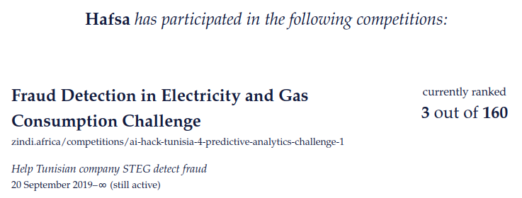

## Fraud Detection in Electricity and Gas Consumption Challenge

The Tunisian Company of Electricity and Gas (STEG) is public and non-administrative. It is responsible for delivering electricity and gas across Tunisia. The company suffered tremendous losses in 200 million Tunisian Dinars due to fraudulent manipulations of meters by consumers.

The challenge aims to detect and recognise clients involved in fraudulent activities using the client's billing history. The findings will enhance the company’s revenues and reduce losses.

## Table of contents

- [Quick start](#quick-start)
- [What's included](#whats-included)
- [Results](#results)
- [Possible improvements](#possible-improvements)
- [Creator](#creators)
- [Copyright and license](#copyright-and-license)

## Quick start

The challenge launched by the Tunisian Company of Electricity and Gas (STEG) contained two csv files. The first contains an annotated (fraudulent or not) list of clients with their locations and categories. The second one contains a list of invoices for each client over time. 

The goal of the current repo is to address the following questions:
1. What is the rate of fraudulent clients in the dataset?
2. How are the fraudulent clients distributed across regions/ districts?
3. What period did the most Fraudulent clients join the company?
4. What variables/combination of variables can be used to predict if a client is fraudulent or not?

## What's included

The [notebook](https://github.com/BHafsa/STEG-Fraud-Detection/blob/main/Fraud_Detection_STEG.ipynb) contains the code and the results for each step of the modelling process. It is organised in two main steps:

1. Exploratory Data Analysis
    - Data type/description
    - Clients distribution per region
    - Clients distribution per category

2. Data Modeling
    - Data cleaning
    - Feature engineering
    - Feature Selection
    - Fraud detection using xgboost

## Results

## Further improvements

The hyper-parameters of the model were picked randomly. Optimising these hyper-parameters (e.g., using Optuna) would probably improve the current notebook's results.

## Creator

**Bousbiat Hafsa**

- <https://www.linkedin.com/in/hafsa-bousbiat-535ba6ba/
- <https://github.com/BHafsa

## Copyright and license

Code released under the [MIT License](https://github.com/BHafsa/STEG-Fraud-Detection/blob/main/LICENSE). 
